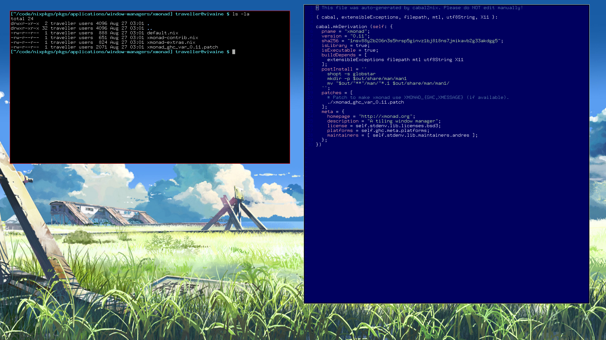

# Intro

A description in code of my [NixOS](http://nixos.org/) setup.

# Screenshot

# Deployment

1. [Install NixOS](http://nixos.org/nixos/manual/#sec-installation).

2. Replace `/etc/nixos/configuration.nix` with `configuration.nix` from this directory. Run `nixos-rebuild switch` from root.

3. Create symlinks in `~` to the files in `dotfiles`.

4. Move a copy of `.bashrc`, `.vimrc`, and `.vim` to `/root`.
